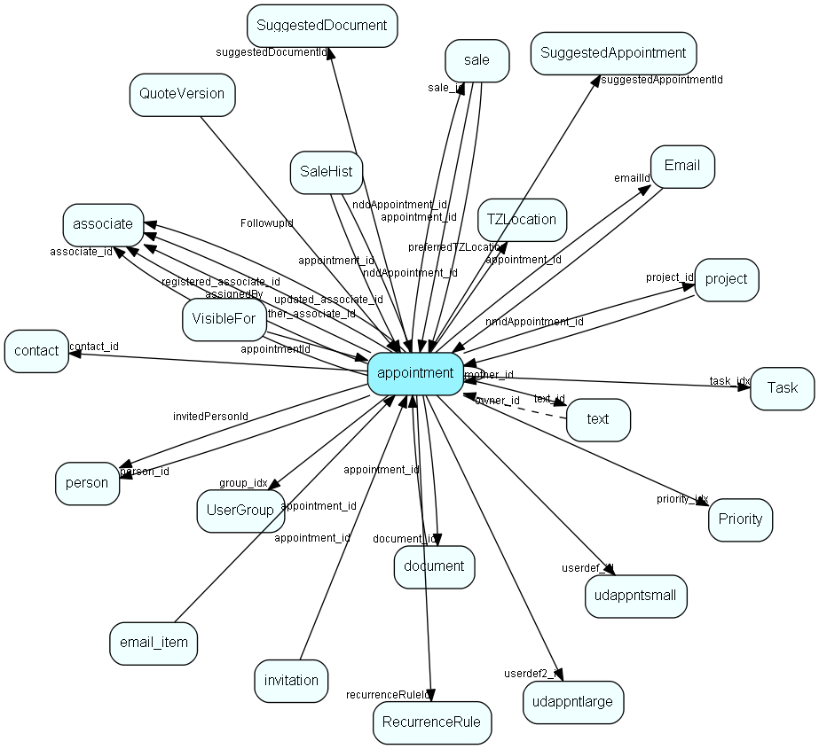

# appointment Table (9)

## Fields

| Name | Description | Type | Null |
|------|-------------|------|:----:|
|appointment\_id|Primary key|PK| |
|contact\_id|Contact ID of owning contact, may be 0|FK [contact](contact.md)|&#x25CF;|
|person\_id|Person ID of person the appointment is with, may be 0|FK [person](person.md)|&#x25CF;|
|associate\_id|ID of associate whose diary the appointment is in, REQUIRED|FK [associate](associate.md)| |
|group\_idx|Group of owning associate at the time tha ppnt was created|FK [UserGroup](usergroup.md)| |
|registered|Registered date|UtcDateTime| |
|registered\_associate\_id|Registered by whom|FK [associate](associate.md)|&#x25CF;|
|done|date + start time this task was done|DateTime| |
|do\_by|date + start time planned|DateTime|&#x25CF;|
|leadtime|Time blocked (minutes) BEFORE starttime|UShort|&#x25CF;|
|task\_idx|Link to Task list, OR to DocTmpl list, if this is a document|FK [Task](task.md)| |
|priority\_idx|Link to priority list|FK [Priority](priority.md)|&#x25CF;|
|type|where=no start time,note,docin, docout |Enum [AppointmentType](enums/appointmenttype.md)|&#x25CF;|
|status|status=done,started, not started, hidden|Enum [AppointmentStatus](enums/appointmentstatus.md)|&#x25CF;|
|private|Obsolete, but still maintained field for appointment privacy; denormalization of visiblefor status|Enum [AppointmentPrivate](enums/appointmentprivate.md)|&#x25CF;|
|alarm|Alarm leadtime, the alarm flag has moved to hasAlarm|UShort|&#x25CF;|
|text\_id|ID of record containing appointment text|FK [text](text.md)|&#x25CF;|
|project\_id|ID of project referred to, may be 0|FK [project](project.md)|&#x25CF;|
|mother\_id|ID of mother appointment; self if booking master, master ID if booking slave, 0 if normal appointment. However, if 0 and assoc_id != reg_id then this is an assigned appointment, indicated vt type = kBooking|FK [appointment](appointment.md)|&#x25CF;|
|document\_id|Points to document record; 0 for non-document appointments!|FK [document](document.md)|&#x25CF;|
|color\_index|Appointment colour, used only in Japanese versions. Western versions take colour from Task|UShort|&#x25CF;|
|invitedPersonId|Valid when mother_id != 0 &amp;&amp; mother_id != id|FK [person](person.md)|&#x25CF;|
|activeDate|The date to be used for searching &amp; showing|DateTime|&#x25CF;|
|endDate|Date + end time planned|DateTime|&#x25CF;|
|lagTime|as leadtime, but after the end - time blocked for travel etc.|UShort|&#x25CF;|
|source|For future integration use; source of record|UShort|&#x25CF;|
|userdef\_id|User defined table record 1 (for future use)|FK [udappntsmall](udappntsmall.md)|&#x25CF;|
|userdef2\_id|User defined table record 2 (for future use)|FK [udappntlarge](udappntlarge.md)|&#x25CF;|
|updated|Updated date|UtcDateTime| |
|updated\_associate\_id|Updated by who|FK [associate](associate.md)| |
|updatedCount|Number of updates made to this record|UShort| |
|activeLinks|Number of active links to documents, other appointments, and such|UInt|&#x25CF;|
|recurrenceRuleId|Pointer to recurrence rule, for recurring appointments, otherwise 0|FK [RecurrenceRule](recurrencerule.md)|&#x25CF;|
|location|Location for appointment, defaulted from invited resource of type place and other rules, but you can write anything you want here|String(254)|&#x25CF;|
|alldayEvent|Is this an all day event: 0 = No, 1 = Yes|Enum [AllDayEvent](enums/alldayevent.md)|&#x25CF;|
|freeBusy|What kind of time is this: 0 = Busy, 1 = Free|Enum [FreeBusy](enums/freebusy.md)|&#x25CF;|
|rejectCounter|How many invitees have rejected this appointment|UShort|&#x25CF;|
|emailId|If invitation and status changes should be mailed, this is the ID of the email address used|FK [Email](email.md)|&#x25CF;|
|rejectReason|Why was this booking or assignment rejected, the RejectReason list is a source of suggestions but you can write anything here|String(254)|&#x25CF;|
|hasAlarm|Does this appointment have an alarm|Bool|&#x25CF;|
|assignedBy|Who (last) assigned this appointment to associate_id?|FK [associate](associate.md)|&#x25CF;|
|preferredTZLocation|Preferred timezone location to use when displaying/editing this appointment|FK [TZLocation](tzlocation.md)|&#x25CF;|
|sale\_id|Owning sale, if any (may be 0)|FK [sale](sale.md)|&#x25CF;|
|suggestedAppointmentId|Suggested guide item that this appointment is an instance of (Note: NOT VALID for document-type appointments, they have their own link)|FK [SuggestedAppointment](suggestedappointment.md)|&#x25CF;|
|suggestedDocumentId|Suggested guide item that this document is an instance of (Note: NOT valid for appointments, they have their own link)|FK [SuggestedDocument](suggesteddocument.md)|&#x25CF;|
|isMilestone|Is this appointment a milestone?|Bool|&#x25CF;|
|join\_videomeet\_url|Blank when not a video meeting. Filled with Join Meeting URL when created.|String(2000)|&#x25CF;|
|centralservice\_videomeet\_id|GUID for video meeting in central services – this is set when we create meetings from SuperOffice. It is blank for incoming meetings created from inbox.|String(100)|&#x25CF;|
|original\_start\_date|The original start date for an appointment in a recurring series|DateTime|&#x25CF;|
|cautionWarning|Status field to indicate appointments that have some sort of problem|Enum [AppointmentCautionWarning](enums/appointmentcautionwarning.md)|&#x25CF;|
|mother\_associate\_id|Associate/owner of the mother appointment|FK [associate](associate.md)|&#x25CF;|

## Indexes

| Fields | Types | Description |
|--------|-------|-------------|
|appointment\_id |PK |Clustered, Unique |
|contact\_id |FK |Index |
|person\_id |FK |Index |
|group\_idx |FK |Index |
|done |DateTime |Index |
|do\_by |DateTime |Index |
|text\_id |FK |Index |
|project\_id |FK |Index |
|mother\_id |FK |Index |
|document\_id |FK |Index |
|activeDate |DateTime |Index |
|source |UShort |Index |
|userdef\_id |FK |Index |
|userdef2\_id |FK |Index |
|sale\_id |FK |Index |
|suggestedAppointmentId |FK |Index |
|suggestedDocumentId |FK |Index |
|project\_id, type |FK, Enum |Index |
|contact\_id, type |FK, Enum |Index |
|associate\_id, type, status, done |FK, Enum, Enum, DateTime |Index |
|associate\_id, type, status, do\_by |FK, Enum, Enum, DateTime |Index |
|associate\_id, type, endDate, do\_by |FK, Enum, DateTime, DateTime |Index |
|associate\_id, type, status, activeDate |FK, Enum, Enum, DateTime |Index |
|recurrenceRuleId, activeDate, associate\_id |FK, DateTime, FK |Index |
|recurrenceRuleId, activeDate, mother\_id |FK, DateTime, FK |Index |
|associate\_id, activeDate, mother\_id, appointment\_id |FK, DateTime, FK, PK |Unique |
|mother\_id, status, activeDate, registered\_associate\_id, registered, assignedBy, group\_idx, type, associate\_id, appointment\_id |FK, Enum, DateTime, FK, UtcDateTime, FK, FK, Enum, FK, PK |Unique |
|project\_id, type, activeDate, document\_id, associate\_id, group\_idx, mother\_id, assignedBy, appointment\_id, registered, registered\_associate\_id |FK, Enum, DateTime, FK, FK, FK, FK, FK, PK, UtcDateTime, FK |Unique |

## Replication Flags

* Area Management controlled table. Contents replicated to satellites and traveller databases.
* Replicate changes UP from satellites and travellers back to central.
* Copy to satellite and travel prototypes.
* Cache table during filtering.

## Security Flags

* Sentry controls access to items in this table using user's Role and data rights matrix.
* Visibility controlled via matching [VisibleFor](VisibleFor.md) row.

