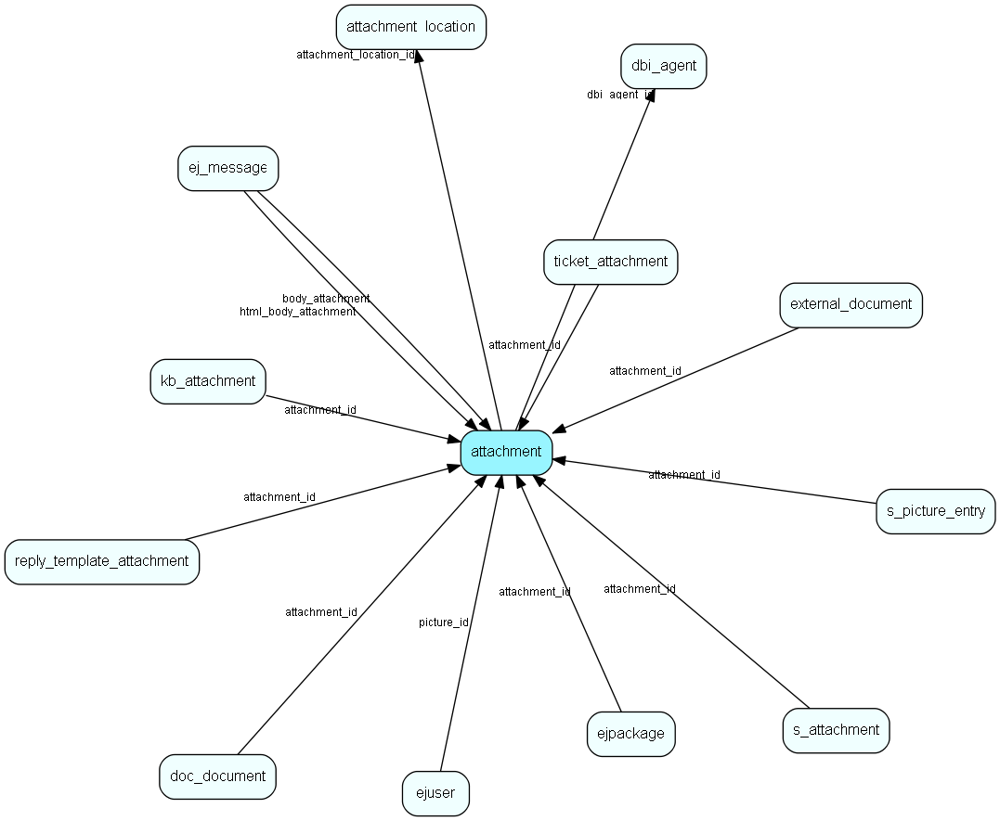

# attachment Table (296)

## Fields

| Name | Description | Type | Null |
|------|-------------|------|:----:|
|id|The primary key (auto-incremented)|PK| |
|content\_type|The content type for the attachment (e.g. &amp;apos;applaction/octet-stream&amp;apos; or &amp;apos;application/vnd.openxmlformats-officedocument.wordprocessingml.document&amp;apos;).|String(255)|&#x25CF;|
|name|The filename for the attachment.|String(255)|&#x25CF;|
|att\_size|The size (in bytes) for the attachment.|Int|&#x25CF;|
|auth\_key|The key used for authenticating access to this attachment.|String(255)|&#x25CF;|
|charset|The charset if this is a text attachment|String(255)|&#x25CF;|
|dbi\_agent\_id|Integration agent (eJournal)|FK [dbi_agent](dbi-agent.md)| |
|dbi\_key|The primary key for the integrated entry in the external datasource.|String(255)| |
|dbi\_last\_syncronized|Last external syncronization.|DateTime| |
|dbi\_last\_modified|When the entry was last modified.|DateTime| |
|attachment\_location\_id|The id of the attachment_location this attachment is stored in|FK [attachment_location](attachment-location.md)|&#x25CF;|

## Indexes

| Fields | Types | Description |
|--------|-------|-------------|
|id |PK |Clustered, Unique |
|dbi\_agent\_id |FK |Index |
|dbi\_key |String(255) |Index |
|dbi\_last\_syncronized |DateTime |Index |
|dbi\_last\_modified |DateTime |Index |

## Replication Flags

* None

## Security Flags

* No access control via user's Role.

