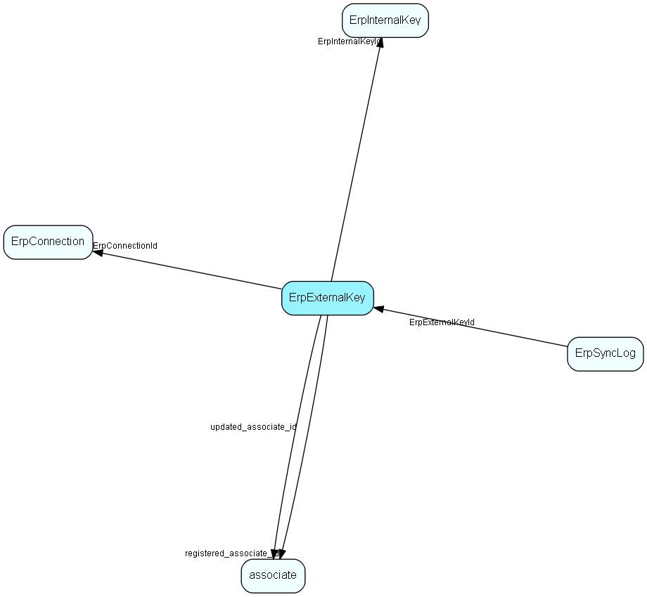

# erpexternalkey Table (423)

## Fields

| Name | Description | Type | Null |
|------|-------------|------|:----:|
|erpexternalkey\_id|Primary key|PK| |
|ErpInternalKeyId|Link to the internal key and thus the original table/record in SuperOffice that is being synchronized|FK [erpinternalkey](erpinternalkey.md)| |
|ErpConnectionId|Link to the Erp connection the key relates to|FK [erpconnection](erpconnection.md)| |
|ErpKey|The primary key from the ERP system|String(254)| |
|ActorType|The actor type within the ERP system of this synchronized record|Enum [erpactortype](enums/erpactortype.md)| |
|MostRecentTimestamp|Datetime, transaction number or other identification of the point in time of the most-recently seen actor in the ERP system|String(254)| |
|registered|Registered when|UtcDateTime| |
|registered\_associate\_id|Registered by whom|FK [associate](associate.md)| |
|updated|Last updated when|UtcDateTime| |
|updated\_associate\_id|Last updated by whom|FK [associate](associate.md)| |
|updatedCount|Number of updates made to this record|UShort| |

[!include[details](./includes/ErpExternalKey.md)]

## Indexes

| Fields | Types | Description |
|--------|-------|-------------|
|erpexternalkey\_id |PK |Clustered, Unique |
|ErpConnectionId, ErpInternalKeyId |FK, FK |Unique |
|ErpConnectionId, ActorType, ErpKey |FK, Enum, String(254) |Unique |
|ErpInternalKeyId |FK |Index |

## Replication Flags

* None

## Security Flags

* No access control via user's Role.

