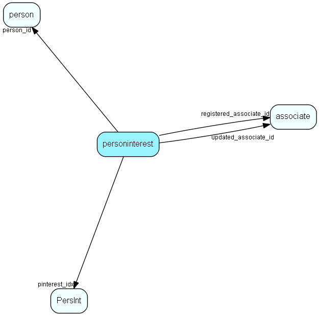

# personinterest Table (15)

## Fields

| Name | Description | Type | Null |
|------|-------------|------|:----:|
|personinterest\_id|Primary key|PK| |
|person\_id|Owning person|FK [person](person.md)| |
|pinterest\_idx|Person interest link|FK [persint](persint.md)| |
|startDate|Start date for this interest - no GUI|DateTime|&#x25CF;|
|endDate|End date for this interest - no GUI|DateTime|&#x25CF;|
|flags|Spare flag field|UInt|&#x25CF;|
|registered|Registered when|UtcDateTime| |
|registered\_associate\_id|Registered by whom|FK [associate](associate.md)| |
|updated|Last updated when|UtcDateTime| |
|updated\_associate\_id|Last updated by whom|FK [associate](associate.md)| |
|updatedCount|Number of updates made to this record|UShort| |

[!include[details](./includes/personinterest.md)]

## Indexes

| Fields | Types | Description |
|--------|-------|-------------|
|personinterest\_id |PK |Unique |
|pinterest\_idx |FK |Index |
|startDate |DateTime |Index |
|endDate |DateTime |Index |
|person\_id, pinterest\_idx |FK, FK |Unique |
|person\_id |FK |Clustered |

## Replication Flags

* Area Management controlled table. Contents replicated to satellites and traveller databases.
* Replicate changes UP from satellites and travellers back to central.
* Copy to satellite and travel prototypes.

## Security Flags

* Sentry controls access to items in this table using user's Role and data rights matrix on the table's parent.

